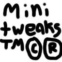

# Minitweaks
Minitweaks is an extension for [Carpet Mod](https://github.com/gnembon/fabric-carpet) with many small, mostly survival-related features and game mechanic changes

# Downloads

# Minitweaks Carpet Rules List
## allChargedCreeperHeadsDrop
All mobs killed by a charged creeper drop their head instead of only one  
* Type: `boolean`
* Default value: `false`
* Required options: `true`, `false`
* Categories: `minitweaks`, `mobs`

## commandSeed
Permission level required to use /seed  
Only available server-side  
ops/2 for only ops, true/0 for anyone  
* Type: `String`
* Default value: `ops`
* Suggested options: `true`, `false`, `ops`
* Categories: `minitweaks`, `command`

## deathItemsDespawnMinutes
How many minutes it takes for a player's items to despawn after death  
-1 for infinte, 0 for instant despawn, max value 32  
* Type: `int`
* Default value: `5`
* Suggested options: `5`, `10`, `15`, `30`, `-1`
* Categories: `minitweaks`, `survival`

## disableBlazeFire
Disables fire made from blaze fireballs  
* Type: `boolean`
* Default value: `false`
* Required options: `true`, `false`
* Categories: `minitweaks`, `mobs`, `survival`

## disableGhastFire
Disables fire made from ghast fireballs  
* Type: `boolean`
* Default value: `false`
* Required options: `true`, `false`
* Categories: `minitweaks`, `mobs`, `survival`

## dispensersBucketMobs
Dispensers can pick up bucketable mobs  
* Type: `boolean`
* Default value: `false`
* Required options: `true`, `false`
* Categories: `minitweaks`, `mobs`, `dispenser`

## dispensersCureVillagers
Dispensers feed golden apples to zombie villagers with weakness  
Note: dispensers curing a villager does not lower the villager's prices due to gossips being player-specific  
* Type: `boolean`
* Default value: `false`
* Required options: `true`, `false`
* Categories: `minitweaks`, `mobs`, `dispenser`, `survival`

## dispensersDuplicateAllays
Dispensers duplicate dancing allays with amethyst shards  
* Type: `boolean`
* Default value: `false`
* Required options: `true`, `false`
* Categories: `minitweaks`, `mobs`, `dispenser`

## dispensersDyeMobs
Dispensers can dye sheep (and shulkers if dyeableShulkers is enabled)  
* Type: `boolean`
* Default value: `false`
* Required options: `true`, `false`
* Categories: `minitweaks`, `mobs`, `dispenser`

## dispensersNameMobs
Dispensers use name tags on mobs  
* Type: `boolean`
* Default value: `false`
* Required options: `true`, `false`
* Categories: `minitweaks`, `mobs`, `dispenser`

## dispensersRepairGolems
Dispensers can repair Iron Golems with iron ingots  
* Type: `boolean`
* Default value: `false`
* Required options: `true`, `false`
* Categories: `minitweaks`, `mobs`, `dispenser`

## dragonBlockDamage
Set dragon block damage breaking type, regardless of mobGriefing gamerule  
default: default block breaking  
none: no blocks are broken  
break: broken blocks are dropped  
destroy: broken blocks are destroyed and not dropped  
* Type: `String`
* Default value: `default`
* Required options: `default`, `none`, `break`, `destroy`
* Categories: `minitweaks`, `mobs`, `survival`

## dyeableShearedSheep
Sheared sheep can be dyed  
* Type: `boolean`
* Default value: `false`
* Required options: `true`, `false`
* Categories: `minitweaks`, `mobs`

## dyeableShulkers
Shulkers can be dyed  
Color can be reset to default using a water bottle  
* Type: `boolean`
* Default value: `false`
* Required options: `true`, `false`
* Categories: `minitweaks`, `mobs`

## echoShardsEnableShriekers
Using an echo shard on a sculk shrieker allows it to summon wardens  
* Type: `boolean`
* Default value: `false`
* Required options: `true`, `false`
* Categories: `minitweaks`, `feature`

## fasterOxidation
Blocks oxidize much faster when touching water  
* Type: `boolean`
* Default value: `false`
* Required options: `true`, `false`
* Categories: `minitweaks`, `survival`, `feature`

## infinityMendingStacking
Allows infinity and mending to stack on bows, like in 1.9 to 1.11  
* Type: `boolean`
* Default value: `false`
* Required options: `true`, `false`
* Categories: `minitweaks`, `enchantment`, `survival`

## lightningGlowifiesSquids
Squids struck by lightning convert to glow squids  
* Type: `boolean`
* Default value: `false`
* Required options: `true`, `false`
* Categories: `minitweaks`, `mobs`

## maxPlayerXpDrop
Maximum amount of xp players drop on death  
* Type: `int`
* Default value: `100`
* Suggested options: `0`, `100`, `1000`, `10000`
* Categories: `minitweaks`, `survival`
* Additional notes:
  * Must be a positive number

## mobItemPickup
Overwrites random default pickup chance when mob spawns  
Only zombie and skeleton type mobs are affected  
default: uses default pickup  
always: mobs pick up items  
never: mobs don't pick up items  
* Type: `String`
* Default value: `default`
* Required options: `default`, `always`, `never`
* Categories: `minitweaks`, `mobs`

## mobsDropNametag
Named mobs drop their name tag on death  
Note: mobs will drop a name tag even if they weren't named with one  
This may also cause name tags to be able to be duped  
* Type: `boolean`
* Default value: `false`
* Required options: `true`, `false`
* Categories: `minitweaks`, `mobs`, `survival`

## moveableWaterloggedBlocks
Waterlogged blocks stay waterlogged when moved with a piston  
* Type: `boolean`
* Default value: `false`
* Required options: `true`, `false`
* Categories: `minitweaks`, `feature`

## noCreeperBlockBreaking
Disables creeper explosion block breaking  
* Type: `boolean`
* Default value: `false`
* Required options: `true`, `false`
* Categories: `minitweaks`, `mobs`, `survival`

## noFeatherFallingTrample
Prevents farmland from being trampled if you have feather falling  
* Type: `boolean`
* Default value: `false`
* Required options: `true`, `false`
* Categories: `minitweaks`, `survival`

## noGhastBlockBreaking
Disables ghast fireball explosion block breaking  
* Type: `boolean`
* Default value: `false`
* Required options: `true`, `false`
* Categories: `minitweaks`, `mobs`, `survival`

## noRepairCost
Removes additional cost for using an item in an anvil multiple times  
* Type: `boolean`
* Default value: `false`
* Required options: `true`, `false`
* Categories: `minitweaks`, `survival`

## noVillagerWitchConversion
Villagers don't convert to witches when struck by lightning  
* Type: `boolean`
* Default value: `false`
* Required options: `true`, `false`
* Categories: `minitweaks`, `mobs`

## phantomSpawningTime
Amount of ticks before Phantoms start having a chance to spawn  
* Type: `int`
* Default value: `72000`
* Suggested options: `72000`, `360000`, `720000`
* Categories: `minitweaks`, `mobs`, `survival`
* Additional notes:
  * Must be a positive number

## protectionStacking
Allows all the different protection types to stack on the same piece of armor, like in 1.14 to 1.14.2  
* Type: `boolean`
* Default value: `false`
* Required options: `true`, `false`
* Categories: `minitweaks`, `enchantment`, `survival`

## quickHarvesting
Right click crops with a hoe to harvest and replant  
* Type: `boolean`
* Default value: `false`
* Required options: `true`, `false`
* Categories: `minitweaks`, `survival`, `feature`

## removableCurses
Curses are also removed when using grindstones or repair crafting  
* Type: `boolean`
* Default value: `false`
* Required options: `true`, `false`
* Categories: `minitweaks`, `enchantment`, `survival`

## renewableDragonEgg
Dragon eggs will always be placed on the portal after defeating the dragon  
* Type: `boolean`
* Default value: `false`
* Required options: `true`, `false`
* Categories: `minitweaks`, `mobs`, `survival`

## renewableRawOres
An anvil landing on Iron/Gold/Copper blocks turns them into the raw ore block version  
* Type: `boolean`
* Default value: `false`
* Required options: `true`, `false`
* Categories: `minitweaks`, `survival`, `feature`

## shaveSnowLayers
Snow layers can be shaved, removing one layer, when right clicked with a shovel  
* Type: `boolean`
* Default value: `false`
* Required options: `true`, `false`
* Categories: `minitweaks`, `survival`, `feature`

## slimeLooting
Bigger slimes spawn more smaller slimes when killed with looting  
Additional slimes can be up to as many levels of looting as you have (up to +3 with looting 3, etc)  
* Type: `boolean`
* Default value: `false`
* Required options: `true`, `false`
* Categories: `minitweaks`, `mobs`, `enchantment`, `survival`

## vexesNerf
Vexes will start to die after the evoker that summoned them dies  
* Type: `boolean`
* Default value: `false`
* Required options: `true`, `false`
* Categories: `minitweaks`, `mobs`, `survival`

## villagersAlwaysConvert
Villagers will always convert to Zombie Villagers when killed by a zombie, even on easy and normal difficulty  
* Type: `boolean`
* Default value: `false`
* Required options: `true`, `false`
* Categories: `minitweaks`, `mobs`, `survival`

## villagersExplodeBeds
Villagers cause explosions when trying to use beds in the nether or end, like players  
"But why?" Idk, it's just a funny idea I had  
* Type: `boolean`
* Default value: `false`
* Required options: `true`, `false`
* Categories: `minitweaks`, `mobs`
